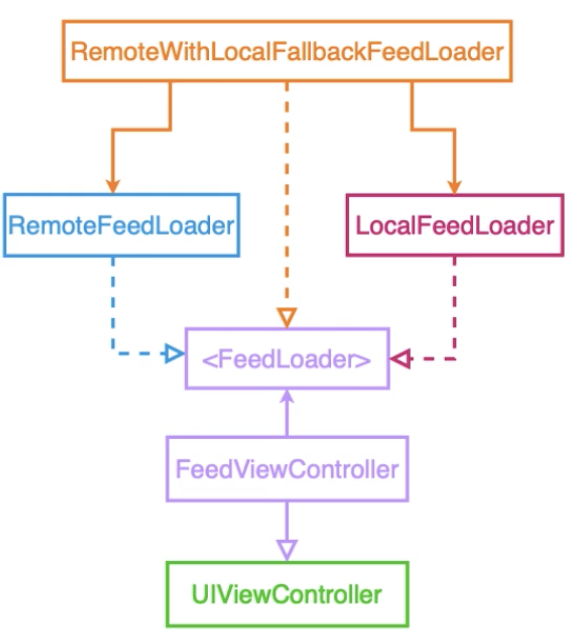

# How Diagrams Translate Into Code

Visualizing our code in diagrams can be a great framework to think while modeling the design of our systems. The early visualization of the design can make an excellent tool for communicating ideas to our colleagues and planning/coordinating a team effort. Diagrams can also help with independent development, as the team can quickly plan new features design (5-10 minutes on a whiteboard), build them in parallel and later integrate the pieces without conflicting with the work of other developers.

Moreover, diagrams serve as a great diagnostic tool as they embody the dependency graph of components and modules, revealing tight coupling and even retain cycles that could potentially lead to rigidity and memory leaks.

### Diagram used in this example

In this example, we will not be concerned with the implementation of the classes themselves, but with how to model a clean architecture for a specific example. The purpose of this example is to show different ways of loading the feed to the user and showing it in the `FeedViewController`.

In this case the `FeedLoader` is a protocol and the `RemoteFeedLoader`, `LocalFeedLoader` and the `RemoteWithLocalFallbackLoader` are the concrete implementations of the `FeedLoader`.

The `RemoteFeedLoader` implements the `FeedLoader` interface and fetches data from the back end. The `RemoteFeedLoader` can live in a separate module, that is why it has a different color, it could be in an API module for example.

We can also have a different implementation of the `FeedLoader`, for example the `LocalFeedLoader` that just fetches some data from a cache system, so if you don’t have internet connection you can still see somethings on the screen. The `LocalFeedLoader` can also be in a separate module, that is why it has a different color.

Now imagine that we have to build the following example: try to connect to the network to fetch data, but if you have no internet connection get data from the cache.

There is a lot of ways we can do that.

An easy and often used approach is to change the ViewController to depend on the concrete types, and instead of talking to an interface the view controller would now depend on the concrete implementation of the RemoteFeedLoader and LocalFeedLoader. However we would have to introduce some logic in the view controller to know which one we should call and when and the code would be more complex, but it would also be an easy change. 

We fulfilled the requirement and move on, now we have two concrete dependencies in the view controller and the code is starting to get more immobile, because every time there is a new requirement we would go in the view controller and add more logic and very easily this view controller will be a thousand lines long. Thus, everybody is going to be afraid of changing it, and our diagram would not be the same anymore.

So how we can go back on our diagram and make the `FeedViewController` depending on the interface but still having this new behavior? In order to do that we can use composition, we can encapsulate this logic into a type that will check if the network is available and fetch the remote, otherwise use the cache

So we move the same logic that we would add in the view controller to a new type: `RemoteWithLocalFallbackLoader`. But how can we make the view controller talk to this new type? As the view controller talks to the FeedLoader interface, we just need to make this new type conforms to the FeedLoader as well, and the view controller remains agnostic of the source of the feed.

As you can see in the diagram the `RemoteWithLocalFallbackLoader` implements the FeedLoader and it depends on the `RemoteFeedLoader` and `LocalFeedLoader`, which means that the `FeedViewController` has no idea of all this logic, which means we changed the behavior of the code without changing the view controller. The `FeedViewController` doesn’t know where the feed is coming from and it doesn’t care and how easy can we test everything now?

In this project there is an example of how to implement the diagram in the image above, taking all that was discussed in consideration.
